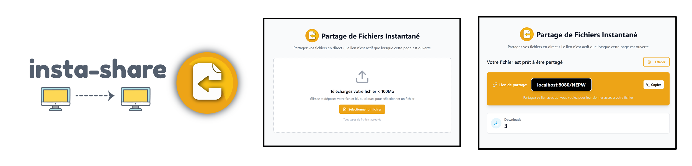

# insta-share

Share files effortlessly with a simple drag-and-drop, and track downloads in real-time.

## Instant File Share

### How it works

Host uploads a file → gets a link like yoursite.com/ABCD

Anyone visits the link → downloads file instantly

Auto-deletes when host closes the page



### Key Features

- ⚡ WebSocket real-time (No storage, RAM only)
- 🔢 4-letter links
- 📊 Live download counter

## Installation

### 1. Configure your deployment url:
Modify .env file in the web directory:

```
VITE_APP_BASE_URL=http://your-site
```
### 2. Build the frontend:

```bash
cd web
npm install
npm run build
cd ..
```

### 3. Deploy with Docker

```bash
# Build the Docker image
docker build -t insta-share .

# Run the container
docker run -d --restart always -p 8080:8080 --name insta-share insta-share
```

### Ports

- 8080: HTTP server and WebSocket server